<p align="center">
  
</p>

<p align="center">
  
  
  
  
  
</p>

<p align="center">
  <a href="#lo-nuevo"><b>Lo nuevo</b></a> ·
  <a href="#así-se-ve"><b>Así se ve</b></a> ·
  <a href="#temas"><b>Temas</b></a> ·
  <a href="#qué-hace"><b>Qué hace</b></a> ·
  <a href="#mapa-de-proyectos"><b>Proyectos</b></a> ·
  <a href="#dónde-corre"><b>Dónde corre</b></a> ·
  <a href="#atalaya-cloud"><b>Cloud</b></a> ·
  <a href="#instalación"><b>Instalar</b></a> ·
  <a href="#seguridad"><b>Seguridad</b></a> ·
  <a href="#hoja-de-ruta"><b>Hoja de ruta</b></a>
</p>

<br>

<p align="center">
  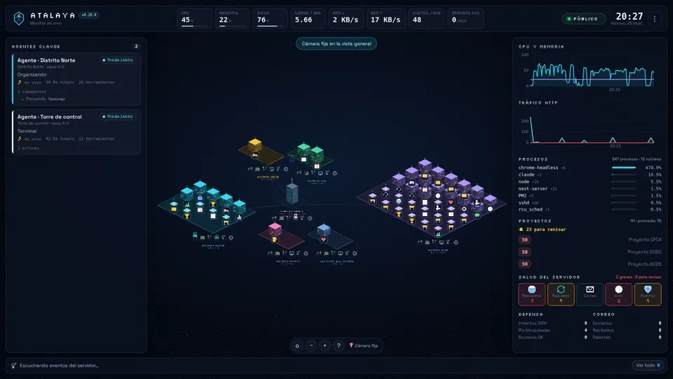
</p>

<p align="center"><sub>Pantalla real en <b>modo público</b>: sin nombres, dominios, rutas ni IPs.</sub></p>
<p align="center"><b>Sitio del proyecto:</b> <a href="https://neracosu.com/atalaya/">neracosu.com/atalaya</a> · <a href="https://neracosu.com/atalaya/vibe-coding/">para vibe coders</a> · <a href="https://neracosu.com/atalaya/guias/">guías paso a paso</a> · pantallas en la nube: <a href="https://nube.neracosu.com">nube.neracosu.com</a></p>

<br>

**Atalaya Monitor Server** convierte todo lo que usted tiene publicado en un **mundo vivo** para la TV de la oficina,
el monitor o el teléfono: una ciudad pixel, una oficina estilo hotel virtual, un acuario, una banda de
MMO, un castillo gótico, una consola de fósforo verde… **diez temas** a elegir. Cada cuenta es un distrito, cada servicio
un edificio (o un pez, o un escritorio), cada visita algo que viaja, cada ataque un invasor que choca
contra el escudo, cada sitio bajo escaneo recibe **patrullas voladoras** que lo custodian, y cada sesión de
Claude Code es un personaje que camina a lo que está haciendo.

Pero no es solo bonito: **une** en una sola pantalla sus hostings compartidos, sitios WordPress, Vercel,
Supabase, GitHub y las laptops con Claude Code (cada VPS tiene su propia Atalaya, que ve todo ese servidor), arma **una ficha por proyecto** y le dice, en lenguaje simple, **qué
revisar y cómo arreglarlo**.

> **Atalaya mira; solo actúa cuando usted lo decide.** No reinicia servicios, no toca sus sitios ni los
> datos de sus bases. Lo pesado corre solo cuando usted lo pide, y los secretos nunca salen del servidor. Lo
> que cambia algo pasa por una **lista cerrada de acciones** que usted pulsa: bloquear por un tiempo una IP
> que ataca (o dejar que lo haga la defensa automática, si la enciende), poner en cuarentena un archivo PHP
> sospechoso (se puede restaurar), activar el usuario de MySQL que solo ve las consultas en curso, instalar
> los hooks de Claude Code y publicar su subdominio en cPanel.

---

## Lo nuevo

<p align="center">
  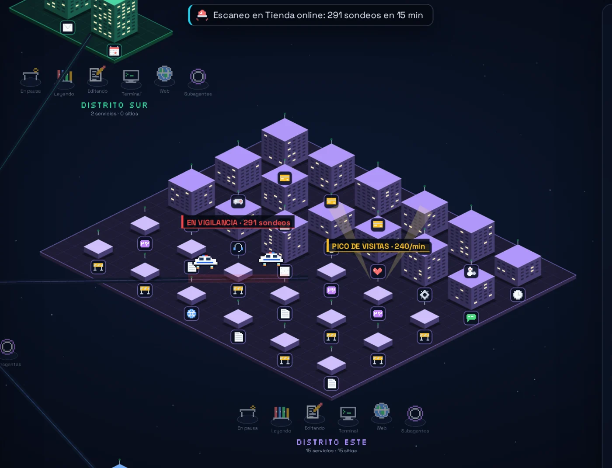
</p>
<p align="center"><sub>Un escaneo con dos <b>patrullas voladoras</b> junto al edificio, un <b>pico de visitas</b> con reflectores y el <b>director</b> contando qué pasa. Datos del simulador, en modo público.</sub></p>

<table>
  <tr>
    <td width="50%" colspan="2" valign="top"><br><b>Latidos: lo que debía correr, ¿corrió?</b><br><sub>Un respaldo, una tarea cron o un programa instalado en el local de un cliente no dan error cuando fallan: simplemente no corren. Con un <b>latido</b>, la tarea toca una dirección secreta al terminar; si deja de tocarla, Atalaya avisa. También puede avisar que falló. Ejemplos listos para cron, Node, Workers de Cloudflare y PowerShell.</sub></td>
    <td valign="top"><br><b>Revisión web diaria</b><br><sub>Cada sitio vigilado se revisa como lo ve un buscador: privados o espejos que <b>se pueden indexar</b>, públicos que <b>dejaron de indexarse</b>, páginas que llegan <b>vacías</b> y <code>robots.txt</code> que <b>bloquea a las IA</b>. Cada falta trae cómo empezar a arreglarla.</sub></td>
  </tr>
  <tr>
    <td colspan="3" valign="top"><br><b>Cloudflare: Pages, Workers y visitas</b><br><sub>Con un token de <b>solo lectura</b>, sus proyectos de Pages y sus Workers son edificios. Ve cada <b>despliegue</b> (construyendo, listo, falló), las <b>corridas</b> de cada Worker y las <b>visitas de cada dominio</b> sin pegar nada en el sitio. Y algo que Cloudflare no avisa: si un <b>reloj (cron) deja de correr</b> no hay error, solo silencio; Atalaya lo nota, pone el edificio en rojo y avisa.</sub></td>
  </tr>
  <tr>
    <td colspan="3" valign="top"><br><b>Sitios vigilados por su dominio</b><br><sub>Para proyectos que viven en <b>Cloudflare Pages, Netlify o Vercel</b>, o cualquier sitio que quiera mirar desde afuera: escribe el dominio y Atalaya lo visita cada 5 minutos, sin instalar nada. Usted decide qué respuesta es la correcta (una puerta que exige llave responde 401 y está sana) y una <b>frase que debe aparecer</b>, que detecta el sitio publicado en blanco. Avisa <b>una vez al caer y una vez al volver</b>; antes lo prueba dos veces, y si es Atalaya la que se quedó sin Internet lo dice y no acusa al sitio. Las visitas llegan con una línea de script sin cookies.</sub></td>
  </tr>
  <tr>
    <td width="33%" valign="top"><br><b>Vigilancia con patrullas voladoras</b><br><sub>Si un sitio recibe un <b>escaneo</b> (cientos de sondeos a .env, phpinfo, paneles) o <b>scraping</b> (una sola IP que lo recorre entero), dos patrullas despegan de la torre de control, vuelan hasta el edificio y lo custodian con las luces encendidas. Cuando la amenaza pasa, vuelven a la torre.</sub></td>
    <td width="33%" valign="top"><br><b>Picos de visitas</b><br><sub>Cuando un sitio recibe varias veces lo normal desde muchas IPs, se encienden <b>reflectores</b>: puede que se hizo viral o que es un ataque distribuido. Su ficha muestra países, referer y páginas para distinguirlo.</sub></td>
    <td width="33%" valign="top"><br><b>El director sigue la acción</b><br><sub>La cámara ya no pasea al azar: va a lo que está pasando (un servicio caído, un archivo expuesto, un agente que pide permiso, un despliegue, una consulta lenta) y lo cuenta con un rótulo arriba.</sub></td>
  </tr>
  <tr>
    <td valign="top"><br><b>Las bases, a la vista</b><br><sub>Cada cuenta tiene su <b>silo de datos</b> con tuberías a los sitios que usan sus bases; por ellas corren pulsos cuando hay consultas. Supabase, como silo verde unido a su app. Conexiones contra el máximo, consultas por segundo, las bases más ocupadas y la consulta más lenta, <b>sin sus valores</b>. Se activa con un botón que crea un usuario de MySQL que solo ve las consultas en curso: no puede leer ni cambiar datos.</sub></td>
    <td valign="top"><br><b>Cada agente con su proyecto</b><br><sub>La tarjeta de cada sesión de Claude Code dice en qué proyecto y en qué cuenta trabaja. Al abrirse una sesión baja un haz de luz; al cerrarse, el robot sube y se va.</sub></td>
    <td valign="top"><br><b>Defensa: detenerlos a tiempo</b><br><sub>Un botón en la ficha bloquea por un tiempo la IP que ataca, y las patrullas <b>se la llevan a la cárcel</b>, donde se ve cada IP bloqueada hasta que sale. Con la <b>defensa automática</b> encendida, bloquea sola a quien encontró una ruta expuesta, hace fuerza bruta, scraping o sondea varios sitios, y frena a los atacantes <b>antes de que el servidor se sature</b>. Si sus sitios están detrás de <b>Cloudflare</b>, el bloqueo se hace también allá.</sub></td>
  </tr>
  <tr>
    <td valign="top"><br><b>Alertas por Telegram y correo</b><br><sub>Lo grave llega al teléfono o al correo aunque nadie mire la pantalla: puertas traseras, caídas, el servidor al límite. Con horario de silencio, un enlace a la ficha y un resumen cada mañana.</sub></td>
    <td colspan="2" valign="top"><br><b>Todo desde la pantalla</b><br><sub>Usuarios (dueño o solo ver), PIN y roles desde el menú, sin terminal. Autos pixel en la autopista, un globo para «Web» y una hoja con lápiz para «Editando».</sub></td>
  </tr>
  <tr>
    <td valign="top">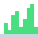<br><b>Analítica sin cookies</b><br><sub>Visitantes, páginas vistas, rebote y páginas por visita de cada sitio por día, semana, mes o año, comparados con el período anterior. De dónde llegan (Google, redes, asistentes de IA, otros sitios, campañas utm), páginas de entrada, países, dispositivos, horas y las páginas rotas que ven sus visitantes. Sale de los registros del servidor: <b>sin código en el sitio ni banner de cookies</b>, y cuenta también a quien usa bloqueador de anuncios. Y el día 1 de cada mes, un <b>informe por correo</b> para sus clientes. Con una línea opcional en el sitio, también el tiempo real en cada página, el rebote real y las conversiones (WhatsApp, llamadas, formularios), igual sin cookies.</sub></td>
    <td valign="top"><br><b>Quién entra a los paneles</b><br><sub>Contraseñas equivocadas en cPanel, WHM y webmail (sin contar escáneres), si root tiene verificación en dos pasos y las últimas entradas con su IP. Avisa por Telegram o correo si alguien entra desde una IP nueva, y en grave si esa IP venía fallando la contraseña.</sub></td>
    <td valign="top"><br><b>Certificados y servicios</b><br><sub>Certificados SSL por vencer, vencidos o autofirmados, con aviso antes de que el navegador asuste a sus visitantes. Servicios que se caen y se levantan solos, los que quedaron fallidos y los procesos que el sistema mató por falta de memoria.</sub></td>
  </tr>
</table>

---

## Así se ve

<table>
  <tr>
    <td width="50%">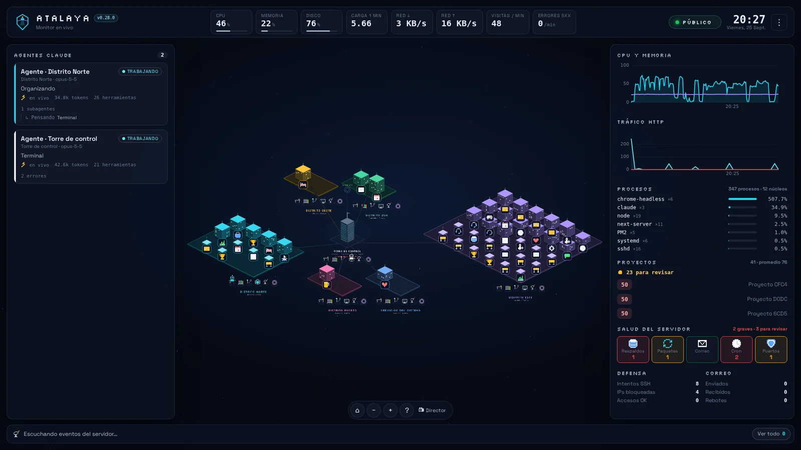<br><sub><b>La ciudad.</b> Distritos, edificios, visitas y agentes en vivo.</sub></td>
    <td width="50%">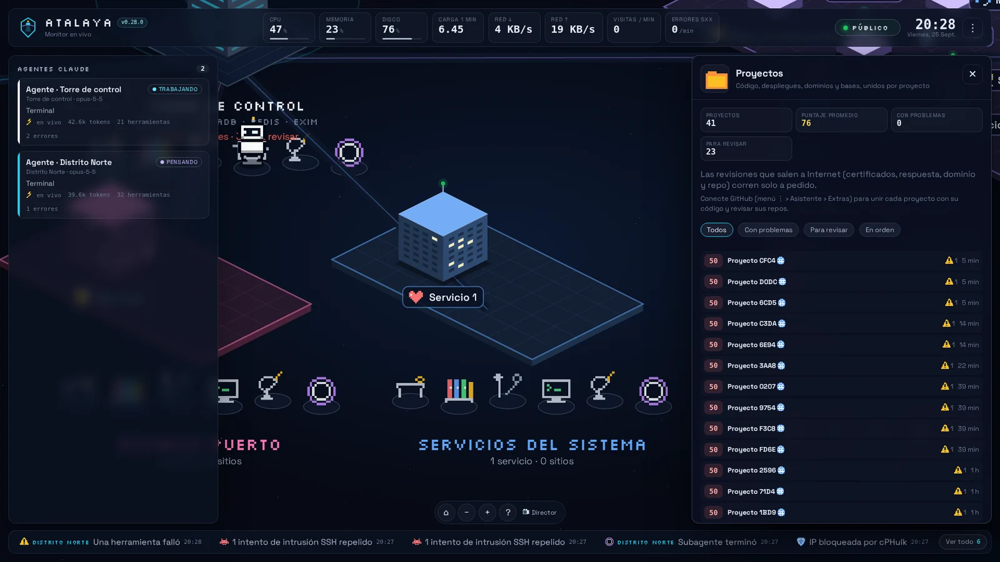<br><sub><b>Proyectos.</b> Cada proyecto con su puntaje de buenas prácticas.</sub></td>
  </tr>
  <tr>
    <td>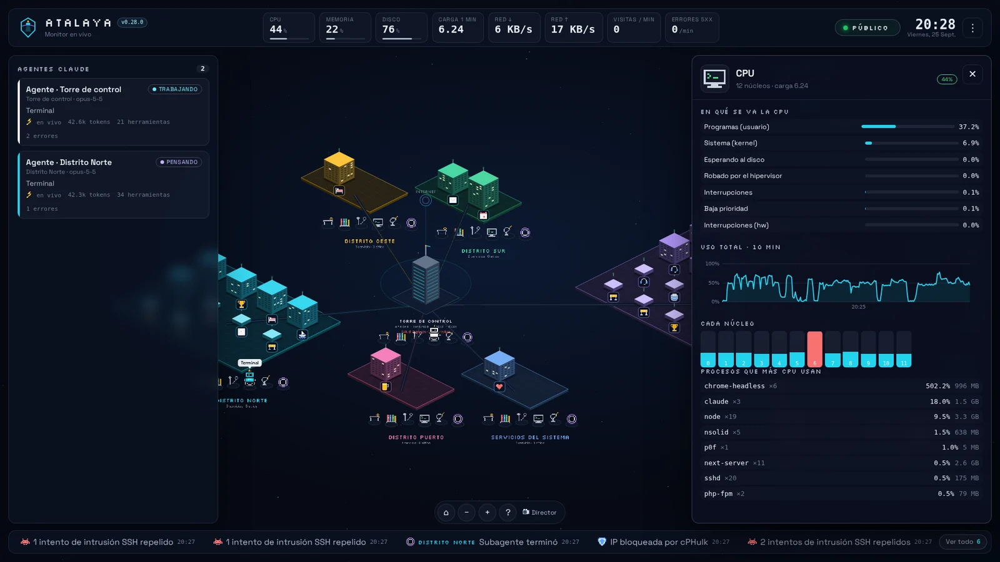<br><sub><b>Cada indicador tiene su ficha.</b> En qué se va la CPU, cada núcleo y los procesos que más usan.</sub></td>
    <td>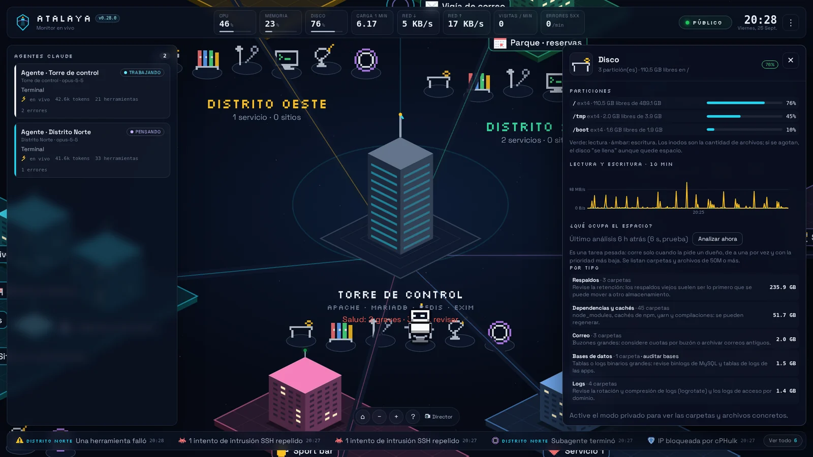<br><sub><b>Disco.</b> Qué ocupa el espacio, con un consejo por tipo.</sub></td>
  </tr>
  <tr>
    <td>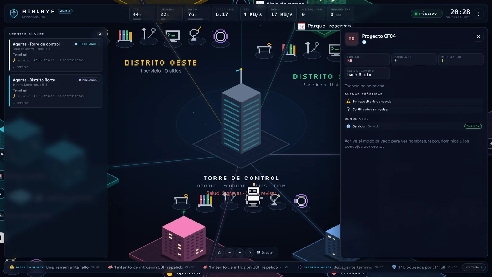<br><sub><b>Ficha de proyecto.</b> Dónde vive y qué revisar.</sub></td>
    <td>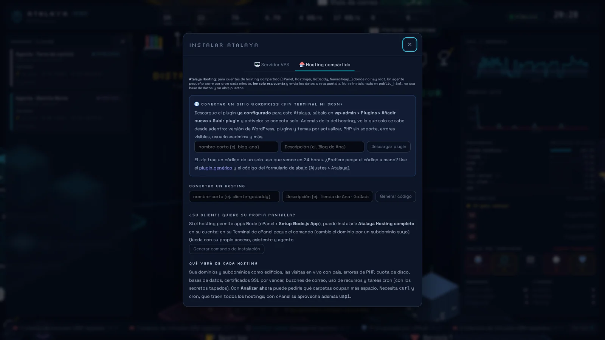<br><sub><b>Conectar.</b> Un hosting con una línea, un WordPress con un plugin.</sub></td>
  </tr>
</table>

---

## Temas

Cada tema cambia **el mundo y el HUD**, no solo los colores. Se elige en el menú › **Tema** (para
esta pantalla o, como dueño, para todas), con la tecla **T** o con `?theme=<id>` en la dirección.

<table>
  <tr>
    <td width="50%">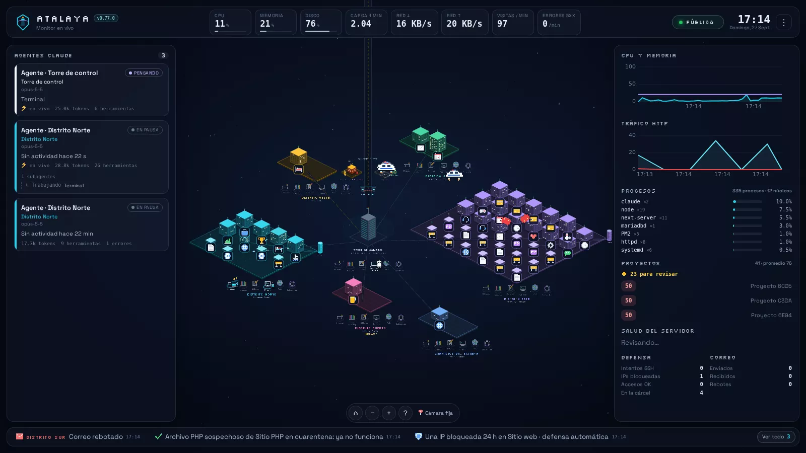<br><sub><b>Ciudad clásica.</b> Distritos isométricos en pixel art, edificios, robots e invasores.</sub></td>
    <td width="50%">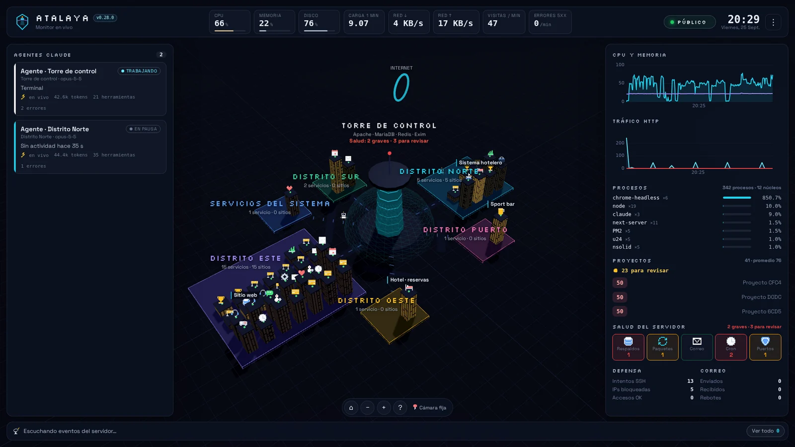<br><sub><b>Ciudad 3D.</b> La ciudad de noche en tres dimensiones: torres que crecen con la memoria, ventanas que se encienden con las visitas.</sub></td>
  </tr>
  <tr>
    <td>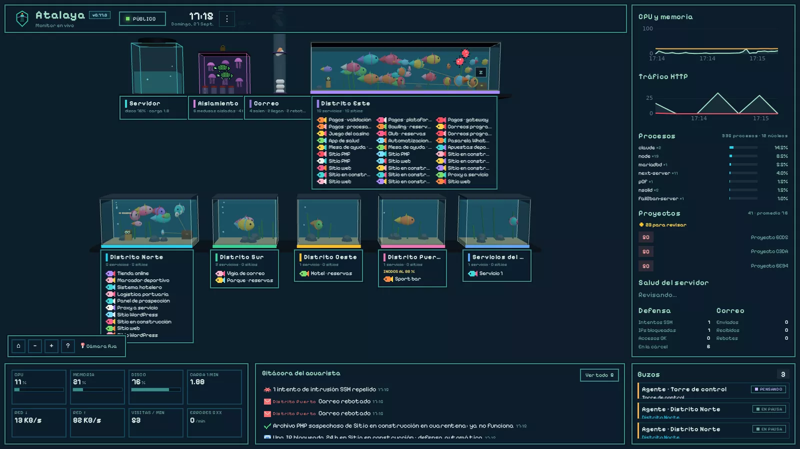<br><sub><b>Acuario.</b> Una pared de peceras en 3D: cada cuenta en su pecera, con una placa que nombra a todos sus peces.</sub></td>
    <td>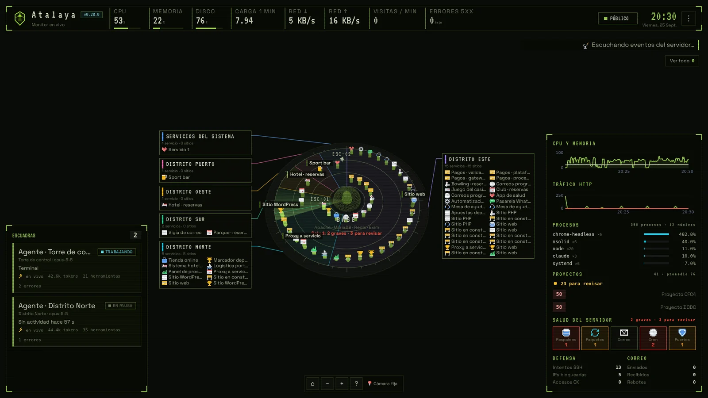<br><sub><b>Ops.</b> Mesa táctica holográfica en 3D con fichas de sector a los costados: columnas, misiles y drones.</sub></td>
  </tr>
  <tr>
    <td>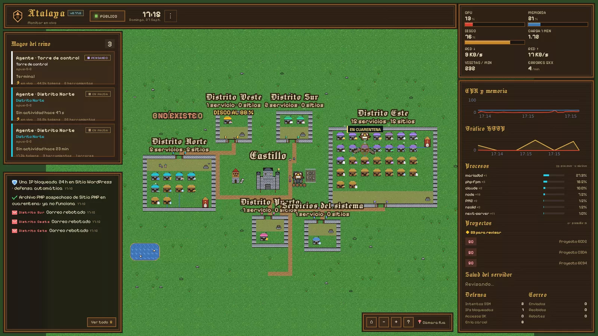<br><sub><b>Villa.</b> RPG de casillas en pixel art: castillo, pueblos amurallados, aldeanos, slimes y magos.</sub></td>
    <td>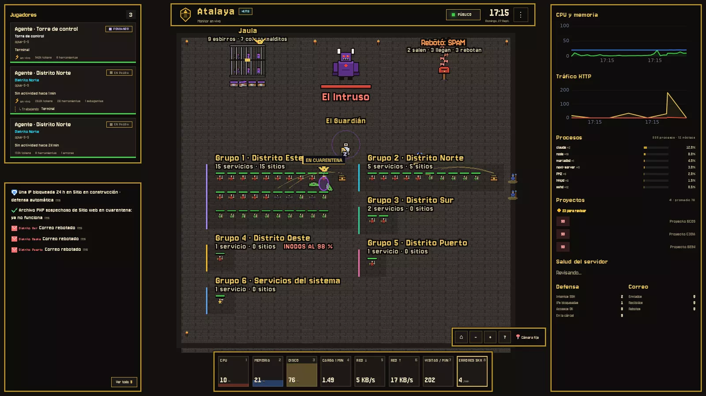<br><sub><b>Raid.</b> Banda de MMO en pixel art: héroes con vida y maná, números de combate y El Intruso, el jefe.</sub></td>
  </tr>
  <tr>
    <td>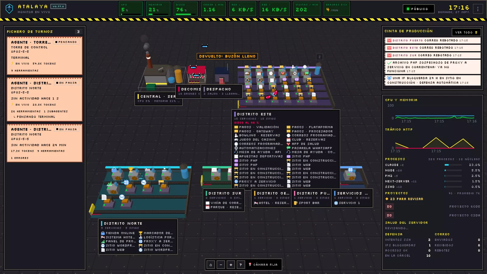<br><sub><b>Planta.</b> Fábrica en 3D con paleta PICO-8: naves, máquinas, cintas, chatarra y drones.</sub></td>
    <td>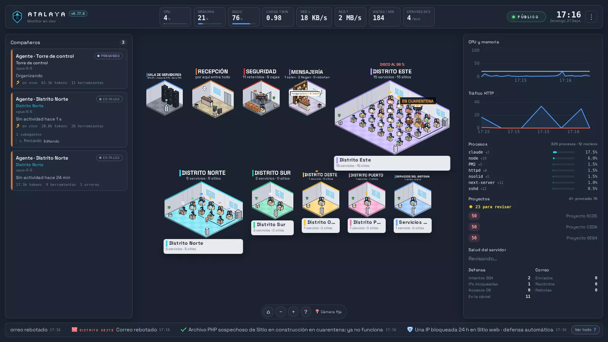<br><sub><b>Oficina.</b> Pixel art isométrico estilo hotel virtual: salas, escritorios con su empleado, aviones de papel y globos de diálogo.</sub></td>
  </tr>
  <tr>
    <td>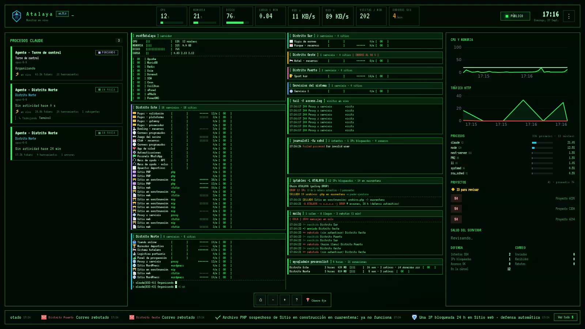<br><sub><b>Terminal.</b> Consola de fósforo verde con ventanas de texto: cada proyecto en su línea, visitas por tail -f y sshd en vivo.</sub></td>
    <td>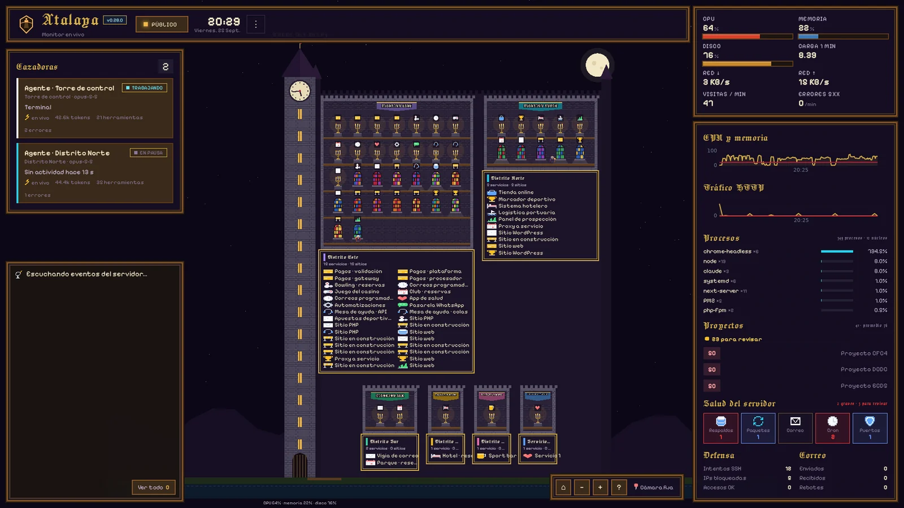<br><sub><b>Castillo.</b> Castillo gótico de costado: torre del reloj, candelabros y vitrales, murciélagos, espectros y cazadoras.</sub></td>
  </tr>
</table>

| En 2D (pixel art, PixiJS) | En 3D (three.js) | Solo texto |
|---|---|---|
| Ciudad clásica · Villa · Raid · Oficina · Castillo | Ciudad 3D · Acuario · Ops · Planta | Terminal |

En todos, **cada proyecto se ubica sin hacer clic**: una placa o un directorio por cuenta nombra lo que
tiene adentro, y al acercarse cada cosa lleva su nombre encima.

Los temas son carpetas con un manifiesto, su mundo y su CSS: **cualquiera puede crear uno**. La guía
está en [docs/TEMAS.md](docs/TEMAS.md), y el **kit de temas** ([neracosu/atalaya-temas](https://github.com/neracosu/atalaya-temas)) trae un
simulador con datos reales en modo público para diseñar sin un servidor. Con solo decir dónde está cada cosa
(`screenOf`), un tema recibe gratis la **capa de efectos** común: patrullas voladoras, reflectores, el director,
los mensajes entre agentes, los robots que sondean, las consultas lentas, la **escolta a la cárcel** y las
**cápsulas de cuarentena**, cada una con **el elenco de su mundo** (`fxSkin`): guardias y búhos en la Villa,
gárgolas y espectros en el Castillo, tortugas y tiburones en el Acuario, montacargas y drones en la Planta; en
Terminal no hay vehículos: todo es una línea de texto. Y cada tema dibuja a su manera la cárcel, el correo, las bases de datos, el servidor al
límite y la cuota de cada cuenta:

| Tema | Cárcel y cuarentena | Correo | Bases de datos | Al límite |
|---|---|---|---|---|
| Ciudad clásica y 3D | cárcel con autos presos, cápsulas | oficina de correos | silos con tuberías | torre roja y fila |
| Villa | calabozo con bandidos, toneles sellados | palomar | graneros con acequias | castillo asediado |
| Oficina | sala de Seguridad, cajas con cinta | mensajería con casilleros | archivadores con cables | aviones en fila frente al ascensor |
| Castillo | mazmorra con espectros, ataúdes | torre de los cuervos | librero de grimorios | asedio y murciélagos en la luna |
| Raid | jaula de esbirros, cofres malditos | buzón con pergaminos | banco del grupo | furia del Intruso |
| Acuario | pecera de aislamiento con medusas, frascos | tubo del correo | cofre del tesoro | agua turbia |
| Ops | zona de detención, contenedores | antena de comunicaciones | depósitos de datos | alerta roja |
| Planta | jaula de decomisos, barriles | despacho por cable | tanques de datos | planta saturada |
| Terminal | `iptables -L ATALAYA`, archivos SELLADOS | `mailq` | `mysqladmin processlist` | aviso `[ GRAVE ]` del sistema |

La **leyenda** (tecla <kbd>?</kbd>) explica cada cosa con el dibujo de su propio tema y muestra su elenco en
«Los que vigilan». Los datos (`state.jail`, `state.silos`, `state.saturation`, `quota`) están para cualquier tema.

### En el teléfono y la tablet

Todos los temas tienen su versión para pantallas chicas: el mundo ocupa el centro (se mueve con el dedo y
se acerca pellizcando), los indicadores van en una tira que se desliza de lado y una barra de pestañas abre
**Agentes**, **Métricas** y **Novedades** como hojas desde abajo. Con el teléfono acostado, las pestañas
pasan a una barra vertical.

<p align="center">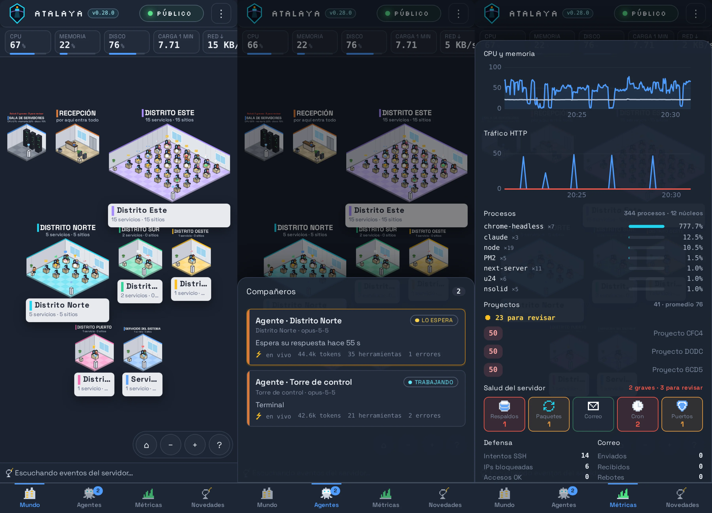</p>

---

## Qué hace

<table>
  <tr>
    <td width="33%" valign="top"><br><b>Todo el servidor, en vivo</b><br><sub>CPU, memoria, disco, red, procesos, PM2, systemd, Docker, visitas y errores por minuto. Cada indicador abre su detalle.</sub></td>
    <td width="33%" valign="top"><br><b>Mapa de proyectos</b><br><sub>Une repo, despliegue, dominio y base aunque vivan en lugares distintos, y le pone un puntaje de 0 a 100.</sub></td>
    <td width="33%" valign="top"><br><b>Claude Code a la vista</b><br><sub>Cada sesión es un robot. Se ve en qué proyecto y cuenta trabaja, qué hace, sus subagentes, los encargos y mensajes que se mandan y cuándo le pide permiso.</sub></td>
  </tr>
  <tr>
    <td valign="top"><br><b>Defensa</b><br><sub>Intentos de SSH, bloqueos de cPHulk, fail2ban y CSF, y los robots que buscan rutas vulnerables en cada sitio (.env, .git, wp-login, phpMyAdmin, webshells), con verificación de archivos expuestos. Escaneos, scraping y picos de visitas ponen al sitio <b>en vigilancia</b>, con patrullas o reflectores.</sub></td>
    <td valign="top"><br><b>Bases de datos</b><br><sub>Tamaño, tablas y qué sitio usa cada base, leído de los archivos. Y, si lo activa, su actividad en vivo con un usuario que solo ve las consultas en curso: nunca lee ni cambia datos.</sub></td>
    <td valign="top"><br><b>Salud del servidor</b><br><sub>Respaldos, actualizaciones, cola de correo, tareas cron, puertos abiertos, certificados SSL por vencer, servicios que se reinician solos, accesos a cPanel y WHM, archivos .git/.env expuestos por cualquier nombre del sitio y apariciones en buscadores de filtraciones (LeakIX), revisados cada 15 minutos (los archivos expuestos y LeakIX, una vez al día; LeakIX pide una clave gratuita en el asistente). Se ve junto al servidor en el mundo y en su ficha, cada hallazgo con su «cómo arreglarlo».</sub></td>
  </tr>
  <tr>
    <td valign="top"><br><b>Hostings compartidos</b><br><sub>Un agente por cron para cPanel, Hostinger, GoDaddy o Namecheap. No toca <code>public_html</code> ni abre puertos.</sub></td>
    <td valign="top"><br><b>Sitios WordPress</b><br><sub>Un plugin que se conecta solo: versión, plugins por actualizar, PHP sin soporte y errores visibles.</sub></td>
    <td valign="top"><br><b>Nube</b><br><sub>Cloudflare (Pages, Workers, relojes y visitas), Vercel (proyectos, despliegues y visitas), Supabase (salud de cada base), GitHub (revisión de repos) y <b>cualquier sitio por su dominio</b>, visitado cada 5 minutos desde afuera.</sub></td>
  </tr>
  <tr>
    <td valign="top"><br><b>Público o privado</b><br><sub>En la TV, sin nombres, IPs ni rutas. Con el PIN, todo el detalle por un rato.</sub></td>
    <td valign="top"><br><b>Análisis a pedido</b><br><sub>Mapa del disco, auditoría de bases y revisión de proyectos. Solo con <b>Analizar ahora</b>, de a uno y con prioridad mínima.</sub></td>
    <td valign="top"><br><b>Se instala solo</b><br><sub>Un comando, una línea de cron o un plugin; lo demás, en un asistente web con código de un solo uso.</sub></td>
  </tr>
  <tr>
    <td valign="top"><br><b>Diez temas</b><br><sub>En pixel art 2D o en 3D, cada uno con su mundo y su HUD. Se cambian en caliente, y la comunidad puede crear los suyos.</sub></td>
    <td valign="top"><br><b>TV, monitor o teléfono</b><br><sub>Del teléfono al monitor ultra ancho: en pantallas chicas los paneles pasan a pestañas y hojas deslizables.</sub></td>
    <td valign="top"><br><b>Cada proyecto con su ícono</b><br><sub>El favicon real de cada sitio, descargado solo y sin IA. Sin favicon, un cartel pixel propio.</sub></td>
  </tr>
</table>

---

## Cómo se conecta todo

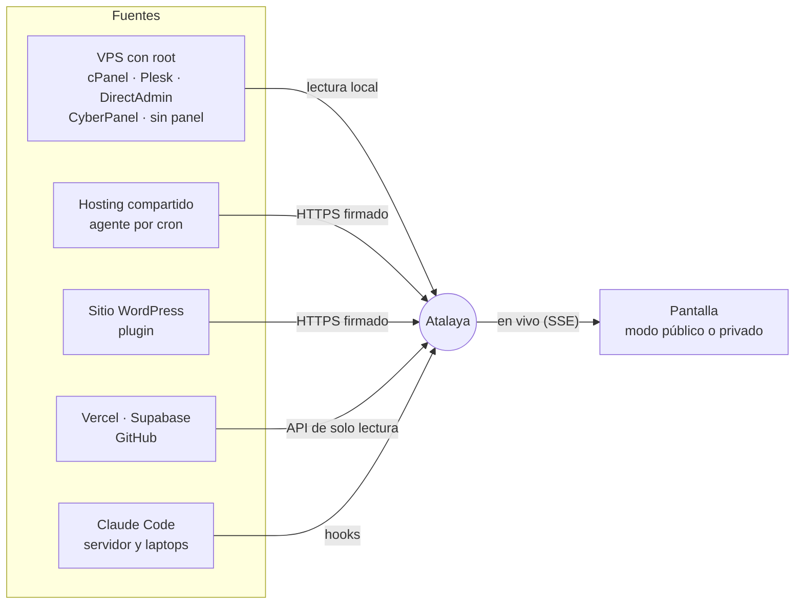
```mermaid
flowchart LR
  subgraph Fuentes
    VPS["VPS con root<br/>cPanel · Plesk · DirectAdmin<br/>CyberPanel · sin panel"]
    HOST["Hosting compartido<br/>agente por cron"]
    WP["Sitio WordPress<br/>plugin"]
    NUBE["Vercel · Supabase<br/>GitHub"]
    CC["Claude Code<br/>servidor y laptops"]
  end
  VPS -- "lectura local" --> A
  HOST -- "HTTPS firmado" --> A
  WP -- "HTTPS firmado" --> A
  NUBE -- "API de solo lectura" --> A
  CC -- "hooks" --> A
  A(("Atalaya")) -- "en vivo (SSE)" --> TV["Pantalla<br/>modo público o privado"]
```

Los agentes y el plugin **solo envían**; Atalaya nunca entra a ellos. Solo puede pedirles dos
cosas, de una lista cerrada: «mándame todo ya» y «dime qué ocupa el espacio».

---

## Mapa de proyectos

Quien arma proyectos rápido (sobre todo con IA) termina con cosas regadas: el repo en GitHub, el
frontend en Vercel, la base en Supabase, una API en un VPS y la landing en un hosting. Atalaya los
**une solos** por repositorio (incluidos los alias SSH de las *deploy keys* y el repo vinculado en
Vercel) y sugiere uniones por nombre parecido. Desde la ficha se une, separa, renombra u oculta.

| Revisión | Qué mira |
|---|---|
| **Código** | ¿Está en un repositorio? ¿Es público? |
| **Secretos** | `.env`, llaves, credenciales o volcados de base subidos al repo; `.gitignore` que no excluye los `.env` |
| **Dependencias** | Alertas de seguridad de Dependabot; lockfile |
| **Despliegue** | Último despliegue fallido, servicio caído, base pausada |
| **Certificados** | SSL inválido, vencido o por vencer |
| **Respuesta** | Código HTTP y tiempo de cada dominio |
| **Dominio** | Fecha de vencimiento del registro (RDAP) |
| **Abandono** | Sin cambios hace meses pero todavía publicado |

Cada sitio y servicio muestra además sus **visitantes ahora** (personas en los últimos 5 minutos, sin
robots), las **visitas y visitantes de hoy**, y de la última hora: páginas más pedidas, de dónde llegan,
países, navegadores, robots y errores.

Cada proyecto se muestra con **su propio ícono**: el favicon de su sitio, que Atalaya descarga solo
(sin IA ni servicios externos, así que funciona en cualquier servidor). Se ve en modo privado; en público,
y en los proyectos que no tienen favicon, cada uno recibe un cartel pixel propio.

---

## Dónde corre

<table>
  <tr>
    <th width="20%"><br>Atalaya Cloud</th>
    <th width="20%"><br>Atalaya VPS</th>
    <th width="20%"><br>Atalaya Hosting</th>
    <th width="20%"><br>Atalaya Equipo</th>
    <th width="20%"><br>Agentes</th>
  </tr>
  <tr>
    <td valign="top">Para quien no tiene servidor: una pantalla alojada en <code>nube.neracosu.com/&lt;cliente&gt;</code>, con registro por invitación. Ve lo que el cliente conecta: nube, sitios por su dominio, hostings, WordPress y laptops.</td>
    <td valign="top">Servidores con root: cPanel/WHM, Plesk, DirectAdmin, CyberPanel o sin panel. Ve <b>todo el servidor</b>. Corre como servicio de systemd de solo lectura.</td>
    <td valign="top">La pantalla completa dentro de una cuenta de hosting con Node (cPanel › <i>Setup Node.js App</i>). Ve <b>esa cuenta</b> y recibe otras.</td>
    <td valign="top">Un <b>ejecutable único</b> para Windows, macOS o Linux: esa computadora, sus sesiones de Claude Code y los conectores de nube. Solo en 127.0.0.1.</td>
    <td valign="top">Para lo que no tiene Node: un <b>script por cron</b> o el <b>plugin de WordPress</b> envían a cualquier Atalaya.</td>
  </tr>
</table>

---

## Atalaya Cloud

Para quien no tiene servidor, o no quiere mantener uno: una pantalla alojada en
[nube.neracosu.com](https://nube.neracosu.com), lista en minutos. Ve solo lo que usted le conecta (Vercel,
Supabase, GitHub, hostings por agente, sitios WordPress y laptops con Claude Code) y nunca mira la máquina
que la aloja.

Durante la beta es por invitación y no se cobra: [pida acceso](https://nube.neracosu.com/solicitud?paquete=cloud).

> Atalaya Cloud es un servicio de NERACOSU. Este repositorio trae la edición `cloud` del servidor, la misma
> que usa cada pantalla alojada; el portal del servicio no forma parte de esta distribución.


---

## Instalación

Atalaya se instala en un **VPS con root** (ve todo el servidor), en una **cuenta de hosting con Node**
(ve esa cuenta) o en **su computadora** (Atalaya Equipo). En los tres casos termina en el mismo lugar: un
**asistente web** donde crea su usuario y su PIN y conecta lo que quiera ver.

<details open>
<summary><b>Atalaya VPS</b> (Linux con root)</summary>

<br>

**Necesita:** Linux con systemd, acceso root y Node.js 20 o superior (si falta, el instalador le dice cómo
instalarlo). Sirve con cPanel/WHM, Plesk, DirectAdmin, CyberPanel o sin panel.

**1. Instale.** Como root (por SSH, en **WHM › Terminal** o en **Plesk › SSH Terminal**):

```sh
git clone https://github.com/neracosu/atalayams.git /opt/atalaya
cd /opt/atalaya && sudo ./install.sh
```

El instalador detecta el panel, crea el servicio de solo lectura `atalaya` (escucha solo en
`127.0.0.1:3950`), le pide el nombre del primer usuario y su PIN, y ofrece instalar los hooks de Claude
Code. Con `--yes` acepta todo lo que tiene valor por defecto. Si prefiere contestar todo en el navegador,
use `sudo ./install.sh --web`: no pregunta nada y deja el asistente web esperándolo (paso 3).

**2. Publíquela en una dirección** para abrirla desde el TV o el teléfono. Atalaya no abre puertos: se ve
detrás del servidor web que ya tiene, en un subdominio como `atalaya.su-dominio.com`.

- **Con cPanel/WHM:** agregue su **dominio principal**, el de una cuenta que ya exista en cPanel, y el
  instalador crea el subdominio `atalaya.` con su certificado y el proxy:

  ```sh
  sudo ./install.sh --domain=su-dominio.com                 # crea atalaya.su-dominio.com
  sudo ./install.sh --domain=su-dominio.com --sub=monitor   # o monitor.su-dominio.com
  ```

  También puede hacerlo después, desde el asistente (paso «Publicar con su propio dominio»).
- **Con otro panel o sin panel:** cree el subdominio en su panel (o su registro DNS) y copie el proxy que
  corresponda. Al terminar, el instalador le dice cuál es:

  | Panel o servidor web | Archivo | Dónde va |
  |---|---|---|
  | Plesk | `deploy/proxy/plesk-nginx.conf` | Directivas adicionales de nginx del subdominio |
  | DirectAdmin | `deploy/proxy/directadmin.conf` | Custom HTTPD Configurations |
  | CyberPanel / OpenLiteSpeed | `deploy/proxy/openlitespeed.conf` | vHost Conf del sitio |
  | nginx | `deploy/proxy/nginx.conf` | un `server` en `sites-enabled` |
  | Apache | `deploy/proxy/apache.conf` | un `VirtualHost` |
  | cPanel a mano | `deploy/proxy/cpanel-htaccess` | `.htaccess` en la carpeta del subdominio |

- **Solo para usted, sin publicar nada:** abra un túnel desde su computadora
  (`ssh -L 3950:127.0.0.1:3950 root@su-servidor`) y entre a `http://localhost:3950`.

**3. Termine en el asistente.** Entre a su dirección (`https://atalaya.su-dominio.com`, o
`http://localhost:3950` por el túnel) con su usuario y PIN, y abra menú › **Asistente de configuración**:
nombre de la pantalla, cuentas, dirección pública, base de países, hooks y conectores de nube. Si instaló con
`--web`, el usuario todavía no existe: abra `https://atalaya.su-dominio.com/setup` y escriba el **código de
configuración** que el instalador muestra al terminar. Mientras no haya usuario, también queda una entrada
temporal en `http://IP-DEL-SERVIDOR:3951/setup` (si su firewall deja pasar ese puerto), que se cierra sola.

**Actualizar:** `cd /opt/atalaya && git pull && sudo ./install.sh --yes`. Conserva `config.json`, los
usuarios y todo lo configurado. Diagnóstico en cualquier momento: `node /opt/atalaya/server/platform`.


</details>

<details>
<summary><b>Atalaya Equipo</b> (ejecutable único para Windows, macOS o Linux)</summary>
<br>

Un solo archivo con Node adentro (Node SEA): se descomprime y se abre. El dueño de un Atalaya VPS lo descarga desde su pantalla (menú › **Atalaya para su computadora**), una vez armado en ese servidor con `node scripts/build-exe.js`. La primera vez extrae la aplicación
en la caché del usuario, elige un puerto libre desde el 3950, abre el navegador en el asistente con el
código ya puesto, y queda escuchando **solo en 127.0.0.1**. Muestra esa computadora (CPU, memoria y
disco; en Linux también red y procesos), sus sesiones de Claude Code (en Windows, las de VS Code y otros IDE y
las que corren dentro de **WSL**, cada distribución como su distrito) y los conectores de nube. Los
hostings y WordPress necesitan una dirección pública: para eso están Cloud y VPS.

| | Datos | Caché de la aplicación |
|---|---|---|
| Windows | `%APPDATA%\Atalaya` | `%LOCALAPPDATA%\Atalaya\app` |
| macOS | `~/Library/Application Support/Atalaya` | `~/Library/Caches/Atalaya` |
| Linux | `~/.local/share/atalaya` | `~/.cache/atalaya` |

Opciones: `--puerto N`, `--sin-navegador`, `--version`. Abrirlo dos veces abre la que ya corre.

**Sin el ejecutable, desde el código** (con Node 20 o superior instalado):

```sh
ATALAYA_EDITION=equipo node server/index.js                 # Linux y macOS
$env:ATALAYA_EDITION='equipo'; node server/index.js         # Windows (PowerShell)
```

Abra `http://127.0.0.1:3950/setup`; el código del asistente queda en `setup-token`, dentro de la carpeta de
datos de la tabla.

Para construirlo (en Linux, con red):

```sh
node scripts/build-exe.js                  # linux-x64, linux-arm64, darwin-x64, darwin-arm64 y win-x64
node scripts/build-exe.js win-x64          # uno solo
```

Descarga el Node oficial de la misma versión (verificado con `SHASUMS256.txt`), inyecta la aplicación con
`postject`, firma ad hoc los de macOS con `rcodesign` y quita la firma rota del `.exe`. Deja en `dist/`
un `.zip` (Windows y macOS) o `.tar.gz` (Linux) con un `LEEME.txt`, más `SHA256SUMS-<versión>.txt`.
Ni el `.exe` ni el binario de macOS tienen firma de un certificado comercial: Windows muestra
«Windows protegió su PC» y macOS pide «Abrir de todas formas» la primera vez.

</details>
<details>
<summary><b>Atalaya Hosting</b> (cuenta de hosting con Node, sin root)</summary>

<br>

**Necesita:** una cuenta de hosting con **Setup Node.js App** (Node 20 o superior), **Terminal** y
**tareas cron**. Ve esa cuenta completa y puede recibir otras.

1. **Cree el subdominio** donde vivirá, por ejemplo `atalaya.su-dominio.com` (cPanel › Dominios).
2. **Descargue Atalaya** en la Terminal de cPanel:

   ```sh
   git clone https://github.com/neracosu/atalayams.git ~/atalaya
   ```

3. **Cree la app** en cPanel › **Setup Node.js App** › *Create Application*: Node 20 o superior, modo
   *Production*, raíz `atalaya`, dirección `atalaya.su-dominio.com` y archivo de inicio `app.js`.
4. **Abra** `https://atalaya.su-dominio.com/setup` y escriba el código del asistente, que está en
   `~/.atalaya-data/setup-token` (`cat ~/.atalaya-data/setup-token` en la Terminal). Un clic conecta la
   cuenta.

Los datos quedan en `~/.atalaya-data`, nunca en `public_html`. Para actualizar: `cd ~/atalaya && git pull`
y reinicie la app desde Setup Node.js App.


</details>

<details>
<summary><b>Conectar un hosting</b> (agente por cron)</summary>

<br>

En su Atalaya: menú › **Conectar un hosting o WordPress**, escriba un nombre corto (ej. `cliente-godaddy`) y
pulse **Generar código**. Le da la línea completa, con la dirección de su Atalaya (`SU-ATALAYA` abajo) y un
código de un solo uso. En la Terminal del hosting:

```sh
curl -fsSL https://SU-ATALAYA/install/agent.sh | sh -s -- https://SU-ATALAYA CODIGO
```

Sin terminal, la misma línea va como tarea **cada minuto** en *Trabajos de cron*: se instala y esa
tarea se borra sola. Envía visitas y errores de PHP cada minuto, y cada 10 minutos dominios, cuota,
bases, certificados, correo, recursos y cron (con los secretos tapados). Quitarlo:
`curl -fsSL https://SU-ATALAYA/install/agent.sh | sh -s -- --uninstall`

</details>

<details>
<summary><b>Conectar un sitio WordPress</b> (plugin, sin terminal)</summary>

<br>

1. En su Atalaya: menú › **Conectar un hosting o WordPress**, escriba un nombre corto (ej. `blog-ana`) y pulse
   **Descargar plugin**: un `.zip` ya configurado para su Atalaya.
2. En WordPress: **Plugins › Añadir nuevo › Subir plugin** y **Activar**. Se conecta solo.

Ve la versión y las actualizaciones pendientes del núcleo, plugins y temas, PHP y su fin de
soporte, la base, los usuarios y los errores. Avisa de `WP_DEBUG` visible, `debug.log` descargable,
usuario «admin», registro abierto con rol peligroso, editor de archivos activo y WP-Cron atrasado.
El plugin **no registra rutas públicas**: solo envía. WordPress 5.6+ y PHP 7.4+.

</details>

<details>
<summary><b>Latidos</b> (respaldos, tareas cron y programas)</summary>

<br>

1. En su Atalaya: menú › **Vigilar sitios y latidos** › **Latidos**. Escriba un nombre y cada cuánto debe avisar.
2. Atalaya le da una **dirección secreta**. Se muestra una sola vez.
3. Haga que su tarea la toque al terminar bien:

```sh
# al final de una tarea cron: solo avisa si el comando terminó sin error
0 3 * * * /home/ana/respaldo.sh && curl -fsS -m 10 https://SU-ATALAYA/latido/SU-TOKEN

# avisar que falló
/home/ana/respaldo.sh || curl -fsS -m 10 "https://SU-ATALAYA/latido/SU-TOKEN?estado=fallo"
```

| Estado | Qué significa |
|---|---|
| Al día | La última señal llegó a tiempo |
| Atrasado | Pasó el plazo más la tolerancia y no llegó: avisa |
| Avisó que falló | La tarea corrió pero reportó un error: avisa |
| Esperando la primera señal | Recién creado: no avisa hasta que llegue la primera |
| En pausa | No se revisa ni avisa |

La tolerancia es el 20 % del plazo (mínimo 5 minutos). De la dirección se guarda solo su huella; si la pierde,
genere una nueva. En modo público no se muestran los nombres de los latidos.

</details>

<details>
<summary><b>Conectar Cloudflare</b> (Pages, Workers y visitas)</summary>

<br>

1. En dash.cloudflare.com: su perfil › **API Tokens** › Create Token › **Create Custom Token**.
2. Dele estos permisos, todos de **solo lectura**:

| Permiso | Para qué |
|---|---|
| Account › Cloudflare Pages: Read | Proyectos y despliegues |
| Account › Workers Scripts: Read | Workers y sus relojes |
| Account › Account Analytics: Read | Cuántas veces corrió cada Worker |
| Zone › Zone: Read | La lista de sus dominios |
| Zone › Analytics: Read | Las visitas de cada dominio |

3. En su Atalaya: menú › **Conectar o arreglar proyectos** › **Cloudflare**. Pegue el token y guarde.

Si omite un permiso, esa parte queda apagada y el resto funciona; la Torre de control dice cuál falta.
Con este token Atalaya **no puede cambiar nada** en su cuenta.

**Relojes que callan.** Un Worker con reloj que deja de dispararse no genera ningún error. Atalaya compara
cada cuánto debería correr con la última vez que corrió: si pasaron más de tres vueltas (y al menos tres
horas, porque Cloudflare entrega esas cifras por hora y con atraso), el edificio queda en rojo y llega el aviso.

**Visitas.** Son los totales de Cloudflare para todo el dominio: incluyen robots y llegan con hasta una hora
de atraso. Para páginas, origen y conversiones use además el script de un sitio vigilado.

Este conector es distinto del token de **Defensa web › Cloudflare**, que sí escribe (bloquea IPs) y es opcional.

</details>

<details>
<summary><b>Vigilar un sitio por su dominio</b> (sin instalar nada)</summary>

<br>

Para sitios en Cloudflare Pages, Netlify, Vercel o cualquier otro lugar donde no puede instalar un agente.

1. En su Atalaya: menú › **Vigilar sitios y latidos** › **Vigilar un sitio por su dominio**.
2. Escriba el dominio (`mitienda.com`) o una dirección dentro de él (`mitienda.com/api/salud`).
3. Elija qué respuesta es la correcta y, si quiere, una frase que siempre esté en la página.

| Respuesta correcta | Para qué sirve |
|---|---|
| Que abra bien (2xx) | Una página o una dirección de salud |
| 401 o 403 | Una puerta que **debe** exigir llave: si abre sin ella, avisa |
| 404 | Algo que **no debe** existir en público |
| 204 | Una dirección que responde sin contenido |

Atalaya lo visita cada 5 minutos desde donde corre, así que ve lo mismo que un visitante. Un fallo se
prueba otra vez a los 30 segundos antes de darlo por caído. Si tampoco responde una dirección de control,
el problema es de la conexión de Atalaya: la ficha dice «sin medir» y no se envía ningún aviso.
Guarda las medidas de las últimas 24 horas (disponibilidad y tiempo de respuesta).

**Revisión web diaria.** Una vez al día, y al agregar el sitio, Atalaya lo visita como un buscador. Un sitio
es **privado** si espera 401 o 403, o si su dominio es un espejo técnico (`.pages.dev`, `.vercel.app`,
`.netlify.app`, `.workers.dev`); si no, es **público**.

| Falta | Nivel | En qué sitios |
|---|---|---|
| Se puede indexar | Grave | Privados |
| Dejó de indexarse (`noindex`) | Grave | Públicos |
| Llega vacío a buscadores e IA | Grave | Públicos |
| Sin `robots.txt` de verdad | Grave | Públicos |
| `robots.txt` bloquea a las IA, o a todos | Grave | Públicos |
| Sin sitemap, sin título, sin H1, 200 a una dirección inventada | Aviso | Públicos |
| Sin descripción, sin datos estructurados, sin `llms.txt` | Sugerencia | Públicos |

Solo las graves avisan por Telegram o correo, una vez al aparecer y una al corregirse.

**Visitas**: de estos sitios no hay registros del servidor. La ficha del sitio le da una línea para pegar
antes de `</head>`; con ella ve visitantes, países, páginas, de dónde llegan, tiempo en la página y
conversiones. Sin cookies: la dirección IP no se guarda, solo se usa para el país.

</details>

<details>
<summary><b>Conectar la nube y Claude Code</b></summary>

<br>

Como root, dentro de la carpeta de Atalaya (`cd /opt/atalaya`):

```sh
node cli.js connector add github      # token fine-grained de solo lectura
node cli.js connector add vercel      # token (y secreto del Drain para ver visitas)
node cli.js connector add supabase    # project ref + secret key
node cli.js remote add laptop-ana     # hooks de Claude Code para una laptop
node hooks/install.js                 # hooks de Claude Code en el servidor
```

Para una laptop, lo más simple es el asistente › Extras › **Claude Code en una laptop**: da un comando para
**PowerShell de Windows** y otro para macOS, Linux o WSL. Solo necesita Node.js.

**Qué sale de esa computadora.** El filtro corre allí, antes de enviar, y se puede leer (`~/.claude/atalaya-remote.js`):

| | Qué |
|---|---|
| Siempre | Qué está haciendo Claude, el nombre de la herramienta y el nombre de la carpeta del proyecto |
| Solo si lo enciende | El archivo o comando de cada paso y el comienzo de cada instrucción (200 caracteres), con las llaves tapadas |
| Nunca | El contenido de sus archivos, las respuestas de Claude, el resultado de los comandos, rutas completas ni variables de entorno |

Más fácil desde la pantalla: menú › **Asistente de configuración** › paso *Extras* (ahí está también LeakIX). Los secretos quedan en un archivo 600 y
se toman en caliente.

</details>

---

## Seguridad

- **Solo lectura por diseño.** El servicio corre con una sola capacidad (`CAP_DAC_READ_SEARCH`) y
  `ProtectSystem=strict`. Lo poco que hace el asistente pasa por un ayudante con **lista cerrada**.
- **Bloqueos seguros.** La defensa bloquea IPs en una tabla propia de nftables (`inet atalaya`), aparte de
  iptables, fail2ban y cPHulk, y **siempre con vencimiento**: al cumplirse, nftables la suelta sola. Nunca
  bloquea Cloudflare (dejaría sin servicio a todos los que entran por ese nodo), redes privadas, el propio
  servidor, la lista blanca ni IPs de usuarios de Atalaya; antes de ejecutar, el ayudante vuelve a revisar redes privadas,
  Cloudflare y las IPs del servidor. Los bloqueos manuales de iptables también se ven en la cárcel y se liberan desde ahí.
- **Acceso** con usuario y PIN de 6 dígitos (scrypt, bloqueo por intentos), cookies `HttpOnly` +
  `SameSite=Strict` + `Secure`, CSP estricta y cabecera anti-CSRF.
- **Modo público** filtrado **en el servidor**: en la TV nunca salen nombres, dominios, rutas, IPs,
  comandos ni prompts. Aun en privado se tapan tokens y contraseñas evidentes.
- **Secretos**: nunca en los argumentos de un proceso; de los tokens de agentes, laptops y hooks se
  guarda solo el SHA-256.
- **Agentes y plugin**: vinculación con código de un solo uso, envíos firmados, y ninguna ruta
  pública nueva en el hosting ni en WordPress.
- **Instalación remota**: tokens de 24 h y 5 usos; el paquete se verifica por SHA-256.
- **Salud del servidor**: en la TV (modo público) solo se ve el estado y cuántos hallazgos hay; los
  puertos, los comandos de cron y el detalle, solo en privado.
- **Definiciones firmadas**: lo que Atalaya detecta y cómo empezar a resolverlo (familias de sondeos web,
  motivos de rebote y sus arreglos) viene en `defs/definiciones.json` y se actualiza sola una vez al día desde
  `nube.neracosu.com/definiciones/latest.json`, como las de un antivirus. Solo se aceptan paquetes firmados
  (ed25519) con la clave pública que trae Atalaya, más nuevos y con reglas válidas; no se envía ningún dato.
  La versión bajada queda en la carpeta de datos. Se apaga con `defs.updates: false` en `config.json`.
- **Edición cloud**: no lee nada de la máquina que la aloja, y las salidas a direcciones que da el cliente
  (favicons, sondas web) no alcanzan la red interna.
- **Favicons**: se descargan en el servidor (quien mira la pantalla no se conecta a ningún sitio), solo
  imágenes verificadas por su firma, sin seguir enlaces a IPs internas, y solo se muestran en privado.

---

## Referencia

<details>
<summary><b>Qué es cada cosa en la ciudad</b></summary>

<br>

| En el mundo | Qué es |
|---|---|
| Distrito | Una cuenta de cPanel, un usuario, un hosting, un WordPress o una cuenta de nube |
| Edificio | Un proceso de PM2, un servicio de systemd, un contenedor o un proyecto de Vercel. Altura = memoria, techo naranja = CPU, ventanas = visitas |
| Edificio bajo | Un sitio servido directo (WordPress, PHP, estático, en construcción) |
| Edificio de un latido | Una tarea que debe avisar. Rojo si se atrasó o avisó que falló; ámbar mientras espera la primera señal |
| Edificio de Cloudflare | Un proyecto de Pages o un Worker. Rojo si falló su último despliegue a producción o si su reloj dejó de correr |
| Distrito «Sitios vigilados» | Los sitios que Atalaya visita desde afuera por su dominio; el que no responde se ve caído |
| Luz del techo | Verde en línea, ámbar parcial o desplegando, roja caído |
| Robot | Una sesión de Claude Code; camina a la estación de lo que hace |
| Halo ámbar | El agente espera su permiso o su respuesta |
| Autopista y peaje | Por la autopista llegan las visitas desde Internet; el peaje es el firewall |
| Autos que viajan | Visitas reales: autos pixel del color de la visita (cian personas, gris robots, ámbar error del visitante, rojo error del servidor) |
| Invasores | Intentos fallidos de acceso que revientan contra la barrera del peaje |
| Auto con sirena | Un robot buscando rutas vulnerables en un sitio; si la ruta respondió, el edificio queda en rojo con «EXPUESTO» |
| Patrullas voladoras | El sitio está **en vigilancia**: escaneo, scraping, fuerza bruta, una ruta expuesta o la misma IP en varios sitios. Salen de la torre, lo custodian y vuelven cuando pasa |
| Patrullas con un auto oscuro | Una IP quedó **bloqueada**: las patrullas se la llevan a la cárcel |
| Cárcel | Junto a la autopista: las IPs bloqueadas (a mano en el firewall y por la defensa), un auto tras las rejas por cada una. Al vencer, el auto sale con «LIBERADA» |
| Reflectores | **Pico de visitas**: mucho más tráfico que lo normal, desde muchas IPs (viral o ataque distribuido) |
| Bichos rojos sobre un edificio | Apareció un **archivo PHP sospechoso** en ese sitio (posible puerta trasera): la ficha permite ponerlo en cuarentena |
| Silo en la esquina de un distrito | Las **bases MySQL** de esa cuenta: altura por tamaño, tapa brillante con consultas en curso, rojo con las conexiones al límite, anillos tenues con conexiones dormidas |
| Tuberías con pulsos | Unen un silo con el sitio que usa esa base; los pulsos son consultas en curso |
| Silo verde | Un proyecto de **Supabase**: luces por conexiones, línea de disco usado, gris si está pausado; tubería a su app |
| Cilindro con reloj de arena | Una consulta a la base de ese sitio lleva más de 10 segundos |
| Torre en rojo con ondas de calor | **Servidor al límite** (CPU, memoria, carga o conexiones de MySQL) |
| Atasco en el peaje | Con el servidor al límite, las visitas esperan en fila |
| Autos grises en fila junto a un edificio | Ese sitio se quedó **sin procesos PHP**: sus visitas esperan |
| Haz de luz sobre un robot | Una sesión de Claude Code que empieza (baja) o termina (sube) |
| Estaciones del robot | Escritorio (en pausa), libros (leyendo), hoja con lápiz (editando), monitor (terminal), globo (web), portal (subagentes) |
| Oficina de correos y sobres | Junto a la autopista. Ámbar sale de su cuenta hacia internet, violeta entra y llega a su cuenta, rojo rebota y vuelve roto a quien lo envió con el motivo. La pila de sobres es la cola de correo |

</details>

<details>
<summary><b>Plataformas detectadas</b></summary>

<br>

| | Cuentas y sitios | Visitas | Seguridad | Correo |
|---|---|---|---|---|
| **cPanel/WHM** | `/var/cpanel/users`, `userdata` | domlogs | cPHulk, fail2ban, CSF | Exim |
| **Plesk** | suscripciones en `/var/www/vhosts` | logs por dominio | fail2ban | Postfix |
| **DirectAdmin** | `data/users`, dominios y punteros | `/var/log/httpd/domains` | CSF/LFD | Exim |
| **CyberPanel** | vhosts de OpenLiteSpeed | logs por sitio | fail2ban, CSF | Postfix |
| **Sin panel** | sitios de Nginx y Apache | `access_log` de cada sitio | fail2ban, CSF | Postfix o Exim |
| **Hosting compartido** | `uapi` o `~/domains/*` | `~/access-logs` | — | buzones por `uapi` |

`node server/platform` muestra el diagnóstico. cPanel está probado en producción; las demás
plataformas, con servidores simulados. La edición Hosting y el agente se probaron en una cuenta real
de cPanel sin privilegios; el plugin de WordPress, en un WordPress simulado.

</details>

<details>
<summary><b>Uso y teclas</b></summary>

<br>

- **Modo director**: la cámara sigue lo que pasa en el servidor (lo más grave primero) con un rótulo que lo
  cuenta; sin novedades, muestra lo activo o recorre los distritos. Si usted mueve la cámara, se aparta.
- **Clic** en cualquier cosa abre su detalle; **pasar el mouse** explica qué es.
- **Navegar**: arrastrar para mover (o girar, en los temas 3D), rueda o pellizco para acercar, doble
  clic para volver a la vista general.
- **Teclas**: `T` tema · `D` director · `P` modo privado · `L` modo público · `F` pantalla completa ·
  `?` o `H` leyenda · `Esc` cierra la ficha abierta (sin nada abierto, pasa a modo público).
- **Teléfono y tablet**: pestañas abajo (Mundo, Agentes, Métricas, Novedades); con el teléfono
  acostado, a la derecha.
- **Novedades**: junto al nombre; al actualizarse, la pantalla se recarga sola y muestra qué cambió.

</details>

<details>
<summary><b>Usuarios</b></summary>

<br>

Desde la pantalla: **menú › Usuarios** (un dueño con el modo privado activo). Ahí se agregan, se les cambia
el PIN o el rol (**dueño**: modo privado y configuración; **solo ver**: para el TV) y se borran. Nadie puede
borrarse a sí mismo ni dejar la pantalla sin dueños, y cambiar el PIN de alguien o borrarlo cierra sus
sesiones al instante.

Lo mismo por terminal, si la prefiere:

```sh
node cli.js user add neri              # dueño: modo privado y análisis
node cli.js user add tv --viewer       # solo modo público
node cli.js user pin neri              # cambiar PIN (cierra sus sesiones)
node cli.js user del tv                # borrar (sus pantallas se cortan al instante)
node cli.js sessions revoke            # cerrar todas las sesiones
```

</details>

<details>
<summary><b>Configuración</b></summary>

<br>

Casi todo se ajusta en el asistente (`<stateDir>/settings.json`). Para ajustes finos, `config.json`:

| Clave | Para qué |
|---|---|
| `accounts` | Etiqueta privada, pública y color de cada cuenta |
| `apps`, `sites` | Nombre e ícono de cada app o dominio (si no se indica, se usa su favicon o un cartel pixel propio) |
| `theme` | Tema inicial; el que se elige en el menú › Tema se guarda aparte y manda |
| `services` | Unidades de systemd: `include`, `exclude` o `disabled: true` |
| `public` | Mostrar nombres reales en modo público (por defecto no) |
| `privateOptions` | Duraciones del modo privado |
| `claude` | Cuándo una sesión pasa a pausa o se retira |
| `logs`, `docker.socket`, `mysql.datadir` | Rutas si no se detectan solas |
| `diskmap.daily` | Analizar el disco cada madrugada (por defecto, solo a pedido) |
| `logs.traffic` | Registro de tráfico en vivo si no está en la ruta de cPanel |
| `projects` | Uniones, nombres y proyectos ocultos: los guarda la ficha, aquí solo sirven de valor inicial |

</details>

<details>
<summary><b>Arquitectura</b></summary>

<br>

Node.js 20+ **sin dependencias en el servidor**; HTTP + SSE para la pantalla en vivo; PixiJS 8,
three.js, anime.js 4 y uPlot en el navegador.

```
server/             HTTP + SSE, autenticación, privacidad, historial, cola de tareas pesadas
server/collectors/  sistema y PM2, Claude Code, logs, systemd, Docker, métricas, mapa del disco
server/platform/    detección de plataforma (cpanel, plesk, directadmin, cyberpanel, none)
server/connectors/  GitHub, Vercel y Supabase
server/audits/      revisiones: bases, sondas web (TLS, HTTP, RDAP), archivos expuestos, LeakIX, PHP nuevos, cuotas
server/agents.js    receptor de agentes de hosting y del plugin de WordPress
server/projects.js  mapa de proyectos y puntaje de buenas prácticas
server/favicons.js  descarga y guarda el favicon de cada proyecto
server/audits/host.js salud del servidor: respaldos, actualizaciones, correo, cron y puertos
server/audits/services.js certificados SSL y servicios que se reinician solos (chkservd, systemd, falta de memoria)
server/audits/logins.js   accesos a cPanel, WHM y webmail: contraseñas equivocadas y entradas desde IPs nuevas
server/analytics.js       analítica de visitas desde los registros: totales por día y sitio, sin cookies
server/netguard.js  en la nube, ninguna salida hacia la red interna
server/helper.js    ayudante con permisos de root: solo las acciones de su lista cerrada
server/defense.js   cárcel: bloqueos con vencimiento (nftables) y defensa automática
server/webdefense.js, watch.js, saturation.js  sondeos web, vigilancia (escaneo, scraping, picos) y servidor al límite
server/alerts.js    alertas por Telegram y correo; seclog.js, registro de seguridad; defs.js, definiciones firmadas
server/collectors/dbactivity.js  actividad de las bases (conexiones y consultas, sin datos)
exe/                arranque del ejecutable único (edición Equipo); se arma con scripts/build-exe.js
site/               sitio del proyecto (neracosu.com/atalaya), el mismo que ve el público; se arma con scripts/export-site.js
agent/              agente POSIX para hosting compartido
wordpress/          plugin «Atalaya Monitor Server · Agente»
app.js              entrada de Atalaya Hosting
web/                el HUD, los íconos pixel, el asistente y los temas (web/themes/<id>)
web/js/stage3d.js   motor compartido de los temas 3D; web/js/layout.js, placas y reparto de cuentas
kit/                fuente del kit de temas (se exporta a atalaya-temas)
hooks/              hooks de Claude Code
scripts/            instaladores, versiones y recursos del README
test/               pruebas con plataformas, APIs y WordPress simulados
```

</details>

<details>
<summary><b>Desarrollo y versiones</b></summary>

<br>

```sh
npm test                                   # todas las pruebas
node scripts/readme-assets.js banner       # banner animado del README
node scripts/readme-assets.js icons        # íconos pixel del README
node scripts/readme-assets.js capture      # capturas WebP de la pantalla real, de cada tema y del teléfono (siempre en modo público)
node scripts/export-kit.js ../atalaya-temas  # regenera el kit de temas
node scripts/export-site.js /ruta/salida  # arma el sitio de site/ (con sellos de caché); sin ruta, lo publica en neracosu.com/atalaya
```

Versionado semántico; cada cambio queda en [CHANGELOG.md](CHANGELOG.md) y la pantalla lo muestra
en *Novedades*.

</details>

---

## El sitio del proyecto, abierto

El sitio de [neracosu.com/atalaya](https://neracosu.com/atalaya/) vive en [`site/`](site/): es **el mismo** que ve el
público, con su diseño arcade, las grabaciones reales de Atalaya y la página para
[vibe coders](https://neracosu.com/atalaya/vibe-coding/). Si le gusta el estilo, úselo de referencia; si ve algo que
se puede ver mejor (el diseño, los textos, la velocidad, la accesibilidad), proponga el cambio con un pull request.

```sh
node scripts/export-site.js /tmp/sitio        # arma el sitio con sus sellos de caché
cd /tmp/sitio && python3 -m http.server 8080  # y ábralo en http://localhost:8080
```

Las animaciones de `site/assets/video/` salen del simulador del [kit de temas](https://github.com/neracosu/atalaya-temas),
en modo público: no muestran nombres, dominios ni IPs.

---

## Comunidad

Atalaya crece con aportes de quienes lo usan. Si sabe Git, abra un pull request; si no, **no hace falta**:
descargue el .zip del repositorio, haga su cambio y súbalo en [nube.neracosu.com/aportes](https://nube.neracosu.com/aportes).
La guía para su primer aporte, con misiones para empezar e instrucciones para su asistente de IA, está en
[neracosu.com/atalaya/aportar](https://neracosu.com/atalaya/aportar/). Cada aporte se revisa antes de publicarse y
queda con su crédito aquí, en [COLABORADORES.md](COLABORADORES.md) y en el sitio.

<!-- comunidad:inicio -->
_Todavía no hay aportes publicados: el primer nombre de esta lista puede ser el suyo._
<!-- comunidad:fin -->

---

## Hoja de ruta

Atalaya es nuevo y crece con lo que piden quienes lo usan. Si algo le falta,
[abra un issue](https://github.com/neracosu/atalayams/issues) o [pida acceso](https://nube.neracosu.com/solicitud) y cuéntenos.

**Lo que viene:**

- [ ] Más temas: los de la comunidad
- [ ] Distribución de los ejecutables de la edición Equipo
- [ ] Más revisiones: integridad de WordPress
- [ ] **Historial largo en SQLite**: el registro de seguridad y las métricas pasan a una base SQLite (un solo archivo, sin servidor aparte, nunca el MySQL que se vigila) para expedientes de meses y gráficas históricas. Requiere Node 22. Usuarios, ajustes y cárcel siguen en JSON
- [ ] Plugin de WHM y modo cuenta de cPanel
- [ ] Tour guiado

**Hecho:**

- [x] Ciudad pixel, HUD, modo público y privado, Claude Code
- [x] VPS en cPanel, Plesk, DirectAdmin, CyberPanel y sin panel
- [x] Vercel, Supabase y GitHub
- [x] Mapa del disco y auditoría de bases a pedido
- [x] Hostings compartidos por cron y edición Hosting
- [x] Mapa de proyectos con puntaje de buenas prácticas
- [x] Plugin de WordPress
- [x] Sistema de temas con cambio en caliente: **Ciudad clásica**, **Ciudad 3D**, **Acuario**, **Ops**, **Villa**, **Raid**, **Planta**, **Oficina**, **Terminal** y **Castillo**
- [x] **Kit de temas para la comunidad**: repositorio aparte con simulador de datos reales (en modo público), para crear temas sin acceso a un servidor
- [x] Versión para teléfonos y tablets, y pantallas ultra anchas
- [x] Ícono real de cada proyecto (favicon) sin IA ni servicios externos
- [x] **Atalaya Cloud**: una pantalla alojada para quien no tiene servidor, con registro por invitación y planes
- [x] **Sitio del proyecto** con guías paso a paso ([neracosu.com/atalaya](https://neracosu.com/atalaya/))
- [x] **Ejecutable único** para Windows, macOS y Linux (edición Equipo)
- [x] **Comunicación entre agentes a la vista**: encargo y resultado, mensajes y el haz al proyecto que se lee o edita
- [x] **Defensa web**: sondeos de rutas vulnerables por sitio, archivos expuestos verificados y descargas de .git
- [x] **Correo con contexto**: cuenta, remitente, destinatario y motivo de cada rebote
- [x] **Definiciones que se actualizan solas** (firmadas), como las de un antivirus
- [x] Salud del servidor: respaldos, actualizaciones, cola de correo, cron y puertos
- [x] **Vigilancia de sitios**: escaneos, scraping y picos de visitas, con patrullas voladoras y reflectores
- [x] **Actividad de las bases**: conexiones, consultas por segundo y consultas lentas, sin leer datos
- [x] **Director que sigue la acción**, con rótulo y marca en todos los temas
- [x] Usuarios, PIN y roles desde la pantalla
- [x] **Alertas por Telegram y por correo** (Gmail, Outlook, su hosting o cualquier SMTP) con horario de silencio, enlace a la ficha y resumen de cada mañana
- [x] **Defensa**: bloqueo temporal de IPs con un botón o automático, y freno antes de la saturación
- [x] **Saturación visible**: torre al límite, atasco en el peaje y sitios sin procesos PHP-FPM
- [x] **Archivos PHP sospechosos** en los docroots, con cuarentena desde la ficha y quién los buscó
- [x] Cuotas de disco, inodos y ancho de banda por cuenta; tareas cron que producen salida seguido
- [x] **Expediente de cada preso** y registro de seguridad con historial por sitio
- [x] **Certificados SSL** por vencer o autofirmados y **servicios que se reinician solos**, con aviso por Telegram y correo
- [x] **Analítica sin cookies** desde los registros: visitantes, orígenes, páginas, países y dispositivos por día, con comparación
- [x] **Accesos a cPanel y WHM**: contraseñas equivocadas (sin contar escáneres), entradas desde IPs nuevas y aviso si alguien entra después de fallar

---

## Créditos de terceros

Se distribuyen en `web/vendor`, `web/fonts` y `web/themes/<id>`; la base de DB-IP no viene incluida, se descarga al instalar. Licencias en [`licenses/`](licenses/):
[PixiJS](https://pixijs.com), [three.js](https://threejs.org), [anime.js](https://animejs.com) y [uPlot](https://github.com/leeoniya/uPlot) (MIT) ·
[DB-IP Lite](https://db-ip.com) (CC-BY 4.0) ·
fuentes [Silkscreen](https://github.com/googlefonts/silkscreen), [Space Grotesk](https://github.com/floriankarsten/space-grotesk),
[VT323](https://fonts.google.com/specimen/VT323), [Pixelify Sans](https://fonts.google.com/specimen/Pixelify+Sans),
[Jersey 10](https://fonts.google.com/specimen/Jersey+10) y [Jacquard 24](https://fonts.google.com/specimen/Jacquard+24) (SIL OFL 1.1) ·
vencimiento de dominios por [RDAP](https://about.rdap.org).

<br>

<p align="center">
  <br>
  <sub>© 2026 Neri Colón · NERACOSU.
  Distribuido bajo la licencia AGPL-3.0.
  </sub>
</p>

---

## Licencia

Atalaya Monitor Server se distribuye bajo la [GNU Affero General Public License 3.0](LICENSE): puede usarlo,
estudiarlo, modificarlo y compartirlo; si ofrece una versión modificada como servicio, debe publicar sus
cambios con la misma licencia. Atalaya Cloud (el servicio alojado) y la publicación de definiciones son de
[NERACOSU](https://neracosu.com). Cómo contribuir: [CONTRIBUTING.md](CONTRIBUTING.md) · seguridad:
[SECURITY.md](SECURITY.md) · conducta: [CODE_OF_CONDUCT.md](CODE_OF_CONDUCT.md).
